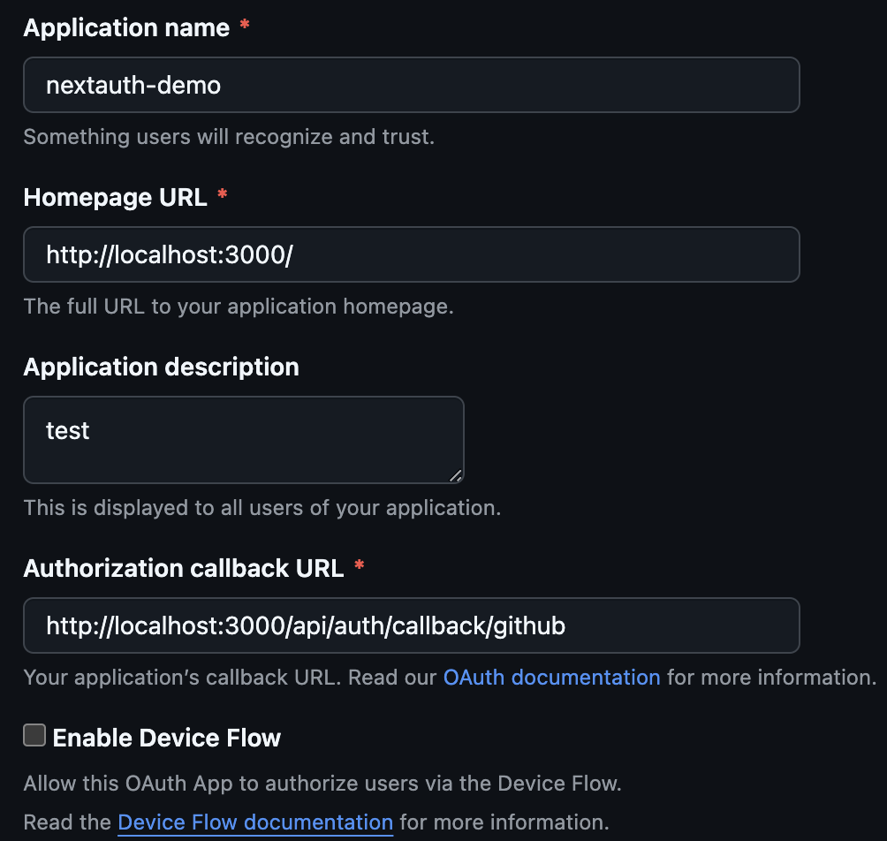

## Objetivo

Entender como funciona um fluxo de oauth através do GitHub.

Entender como mockar elementos de getSession em componentes 'server side' do React.

## Passos

- Inicializar um projeto next.js
  - npx create-next-app@latest
- Implementar testes com Cypress neste template basico
  - npm install cypress --save-dev
  - npx cypress open
- Instalar o maldito next-auth
  - npm install next-auth

## ENV file

`.env.local`

```
NEXTAUTH_SECRET=secret!!!

GITHUB_SECRET=""
GITHUB_ID=""
```


## Tutorial seguido

- https://dev.to/andrews1022/integrate-github-oauth-with-nextauthjs-in-nextjs-13-with-custom-sign-in-out-pages-38mm

## Executando o Cypress

- Precisa estar com o app base rodando
- Abrir o Cypress com o comando
- Executar os testes

## Github oAuth example



